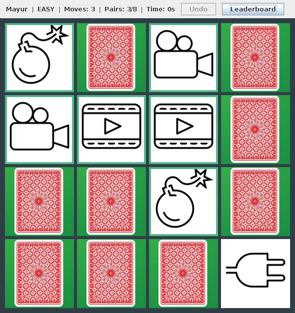
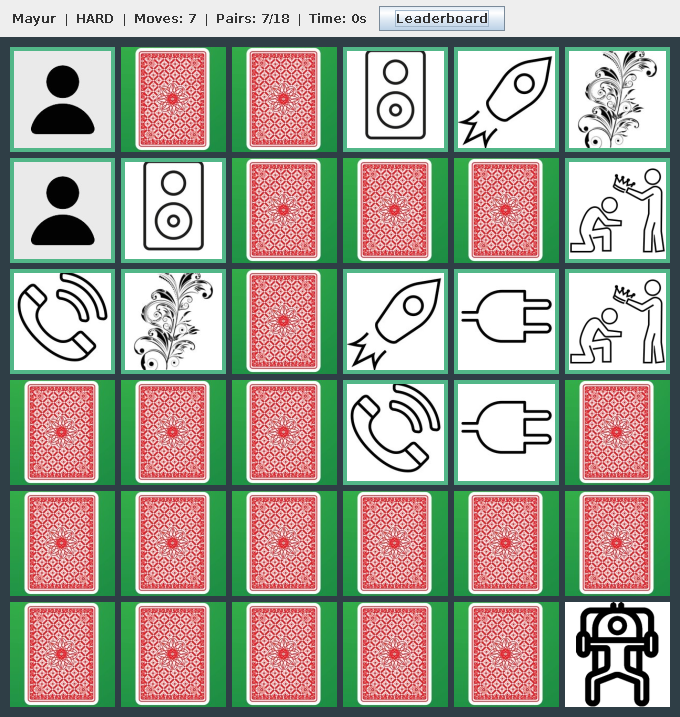

# Memory Match — a card-matching game in Java Swing

Flip two cards at a time and find all the matching pairs in as few moves as
possible. The game has two difficulty levels, a move counter and timer,
**undo** in Easy mode, and a persistent **leaderboard**.

| Easy (4×4, undo enabled) | Hard (6×6) |
|---|---|
|  |  |

Built for *Object Oriented Analysis and Design with Java* (UE19CS353) at
PES University, 2022, by **Mayuravarsha P, Vaibhav S and Tushar Kalaskar**.

## Play

Requires Java 17+ and Maven.

```bash
mvn package
java -jar target/memory-game-2.0.0.jar
```

Enter your name and choose a difficulty. Two non-matching cards stay
visible for 0.75 s and then turn back. Matched pairs stay face up with a
green border. When you finish, your score is ranked by moves (then time) and
saved to `~/.memorygame/leaderboard.tsv`.

## Design

```
memorygame
├── model/            no Swing imports; unit tested
│   ├── Game          rules, move counting, timer, undo history
│   ├── Card          face id + face-up / matched state
│   ├── Difficulty    EASY 4×4 (undo) / HARD 6×6
│   ├── GameListener  observer interface
│   └── Leaderboard   top 10 per difficulty, persisted to a file
└── ui/
    ├── GameWindow    grid of card buttons + status bar; listens to Game
    ├── StartDialog, LeaderboardDialog, CardImages, Launcher
```

| Principle / pattern | Where |
|---|---|
| **Model–View separation** | `Game` knows nothing about Swing. The window only turns clicks into `flip()` calls and redraws when notified, so the rules are tested without a display. |
| **Observer** | `GameListener` (`cardChanged`, `pairResolved`, `gameWon`). The UI never polls the model. |
| **Command history** | Each resolved move is pushed onto a stack. `undo()` pops it and reverts the cards, the pair count and the move count. |
| **Open/closed** | A new board size is one more `Difficulty` constant. Nothing else changes. |
| **Dependency injection** | `Game` takes a `Random` and a clock, so tests get a fixed layout and a controllable timer. |

UML diagrams (use case, class, activity and state) are in
[`docs/uml/`](docs/uml) as StarUML `.mdj` files. The original design
documents and final report are in [`docs/`](docs).

### Game rules as a state machine

```
         flip(a)             flip(b)              resolvePending()
 IDLE ─────────────► ONE UP ─────────────► PAIR SHOWING ──────────────► IDLE
  ▲                                         (clicks ignored)     match: both stay up
  └──────────────────────── undo() (Easy, from IDLE) ◄─────────── no match: both turn back
```

## Tests

```bash
mvn test
```

14 JUnit 5 tests cover the deck (each face exactly twice, reproducible
shuffles), matching and mismatching, ignoring clicks while a pair is
showing, winning with the right move count and time, undo rules, observer
events, and leaderboard ranking, persistence and corrupt-file handling.
GitHub Actions runs `mvn verify` on every push.

## What changed from the course version

The original code is kept in [`legacy/`](legacy/). The rewrite:

* **Moves the rules out of the `JFrame`** so they can be tested. Previously
  game state, timers and rendering all lived in one `Board` class.
* **Fixes the move counter**, which started at 1 and so always reported one
  more move than was played.
* **Fixes a crash when the difficulty dialog is closed**: `Mode` became −1
  and indexed an array.
* Adds the two features the project brief listed as "possible
  improvements": the **leaderboard** and an **easy mode with undo**.
* Replaces the registration form (which collected date of birth, gender and
  country) with a name prompt, since the game only needs a display name.
* Removes duplicate card images in `bin/` and the experimental `Try/`
  classes from the build.
